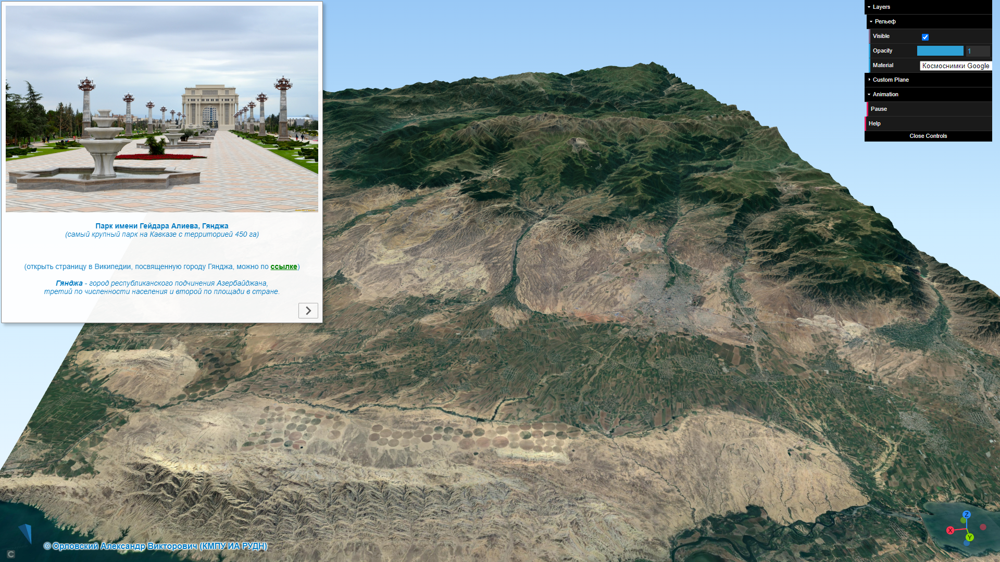

<!-- ВАЖНО: без "layout: default" локально не работает - сайт генерится, но без макета -->
<!-- А на GitHub, если есть любой пункт в заголовке, то сразу стр. 404. Нормально рендерится только когда вообще нет заголовка -->
<!-- Встречал еще какой-то tagline: Easy websites with GitHub Pages -->

<!-- 
    С проблемностью title/description при разворачивании на GitHub нашел пока такой выход:
    Если самая первая строка в README.md «простой текст», а не заголовок, то title/description берутся из _config.yml
 -->

Этот сайт можно открывать по короткой ссылке **bit.ly/RUDN-QGIS-3D-L1**. \
*Регистр букв должен быть сохранен. То есть заглавные буквы должны быть заглавными.*
  

 <!-- двойная разделительная линия ======================================================== -->
 

<!-- TOC -->

### ОГЛАВЛЕНИЕ

- [Введение](#введение)
- [Выбор варианта работы](#выбор-варианта-работы)
- [Процесс создания 3D-модели в QGIS и Qgis2threejs](#хххххххххххххххпроцесс-создания-3d-модели-в-qgis-и-qgis2threejs)
- [Запустите геоинформационную систему QGIS](#запустите-геоинформационную-систему-qgis)
- [Создание базовой 3D-модели в модуле Qgis2threejs](#создание-базовой-3D-модели-в-модуле-Qgis2threejs)
	- [Настройка основных параметров и свойств 3D-сцены](#настройка-основных-параметров-и-свойств-3d-сцены)
	- [Добавление к 3D-модели текстурирующих ЦМР изображений](#добавление-к-3d-модели-текстурирующих-цмр-изображений)
- [Добавление дополнительных элементов оформления](#добавление-дополнительных-элементов-оформления)
- [Окончательные настройки 3D-модели перед экспортом в html](#окончательные-настройки-3d-модели-перед-экспортом-в-html)
- [Создание анимации пролета над поверхностью 3D-модели](#создание-анимации-пролета-над-поверхностью-3d-модели)
	- [Формирование маршрута пролета по ключевым кадрам](#формирование-маршрута-пролета-по-ключевым-кадрам)
	- [Наполнение стоп-кадра повествовательным содержанием](#наполнение-стоп-кадра-повествовательным-содержанием)
- [Экспорт 3D-модели в html-веб-страницу 3D-геопортала](#экспорт-3d-модели-в-html-веб-страницу-3d-геопортала)
- [Публикация html-страницы с 3D-моделью в интернет](#публикация-html-страницы-с-3d-моделью-в-интернет)
- [Экспорт 3D-модели в обменный файл формата glTF](#экспорт-3d-модели-в-обменный-файл-формата-gltf)
- [Обязательный самоконтроль результатов проделанной работы](#обязательный-самоконтроль-результатов-проделанной-работы)
 

<!-- /TOC -->

 

## Введение

Данное практическое занятие посвящено созданию 3D&#8209;моделей местности по реальному рельефу с текстурированием его космическими снимками высокого разрешения и картографическими изображениями. 
Вся работа выполняется в открытой геоинформационной системt (ГИС) **QGIS**. \
В результате работы вами будет выполнен экспорт итоговой 3D&#8209;модели в обменный 3D&#8209;формат, \
а также создан некоторый **3D&#8209;web&#8209;портал**.

В качестве образца того, что у вас должно получиться в результате выполнения работы, 
рекомендуется ориентироваться на подготовленный преподавателем, как пример, \
**«3D-геопортал окрестностей города Гянджа (Азербайджан)»**.

<a href="https://3d-ganja-azerbaijan.netlify.app"
   target="_blank">
   
<a>

*Откройте веб-страницу в отдельном окне, щелкнув левой клавишей мыши по рисунку.* \
В этом образце присутствуют все элементы, которые обязательно должны быть и в вашем итоговом&nbsp;результате.

  
Создайте на своем компьитере в корне диска "C" (или "D") рабочую папку с названием «Work_Dir&#8209;3D».
Все скачиваемые и создаваемые данные помещайте **только в эту папку**.

Установите на ваш компьютер геоинформационную систему QGIS.

> Скачать установщик QGIS для ОС **Windows** (версия 3.16.16) можно по прямой ссылке: 
> **https://download.qgis.org/downloads/QGIS-OSGeo4W-3.16.16-1-Setup-x86_64.exe**

> Установщик QGIS для ОС **macOS** скачайте с сайта проекта QGIS по ссылке:
> **https://qgis.org/ru/site/forusers/download.html**  
> Ставьте наиболее стабильную (LTR) версию.

 

Скачаете файл с необходимой для работы заготовкой QGIS-проекта по 
   <a href="./materials/Заготовка Проекта 3D _ 2024-03-19.qgs" 
      title="Ссылка для загрузки заготовки QGIS-проекта" >
      <!-- target="_blank" я ЗАКОММЕНТИЛ - без него не происходит лишнего "взмигивания страницы". ">" пришлось перенести в строку выше-->
      <b>ссылке</b></a>
и откройте его в&nbsp;геоинформационной системе QGIS.
  

## Выбор варианта работы

Включив в QGIS видимость слоя «Сетка тайлов ЦМР», вы можете выбрать любую интересную вам территорию с эффектным рельефом местности \

Или можете взять район в соответствии с вашим вариантом по номеру в списке группы. \
[Ссылка на страницу выбора «стандартного» варианта работы (по номеру в списке группы)](./materials/variants_of_work.html)
  

## Дополнительные сервисы космоснимков

Скачаете QLR-файл (QGIS Layer Definition File, описание слоя) «Дополнительные сервисы космоснимков.qlr» по 
   <a href="./materials/Дополнительные сервисы космоснимков.qlr" 
      title="Ссылка для загрузки файла «Дополнительные сервисы космоснимков.qlr»" >
      <!-- target="_blank" я ЗАКОММЕНТИЛ - без него не происходит лишнего "взмигивания страницы". ">" пришлось перенести в строку выше-->
      <b>ссылке</b></a>.
  

## Где скачать ЦМР

Как скачать необходимую для работы цифровую модель рельефа прочитайте в инструкции по 
<a href="./materials/Это альтернативный способ скачки DEM SRTM - он даже удобнее.pdf" 
     title="Ссылка на инструкцию" 
     target="_blank">
     <b>ссылке</b></a>.

## Процесс создания 3D-модели в QGIS и Qgis2threejs

**ВНИМАНИЕ !!!**

*Некоторые алгоритмы, которые будут задействованы в ходе лабораторной работы, с «русскими» папками НЕ работают !!!* \
*Поэтому, при выполнении вами данной работы, имена всех файлов, а также пути к ним не должны содержать русских букв и пр. символов (кроме нижнего подчеркивания «_»).* \
*Везде должны быть только английские буквы и/или цифры.* \
***Разумеется нигде, не должно быть пробелов, точек, запятых и т.п.*** \
\
ОБЯЗАТЕЛЬНО проверьте, под какой учетной записью вы работаете на компьютере (ее имя). \
***Как проверить:*** *если у вас ОС Windows, то зайдите в папку «C:/Users/» («C:/Пользователи/») и посмотрите нет ли в ней папок (профилей пользователя) с названиями на русском языке.* \
Если ее название (имя) на русском языке (например, "Евгений", "Мария" и т.п.), то функция «Export&nbsp;to&nbsp;Web» (создание html&#8209;веб&#8209;страницы с вашей 3D&#8209;моделью) работать не будет. \
В этом случае, **СОЗДАЙТЕ на вашем компьютере новую (дополнительную) учетную запись на английском языке и работайте под ней**.
Или работайте под своей обычной учетной записью, а&nbsp;«Export&nbsp;to&nbsp;Web» выполните из&#8209;под новой учетной записью (с именем на английском). \
С какими-либо другими действиями проблем возникать не должно. \
 \
**Создайте внутри папки «RUDN&#8209;QGIS&#8209;3D»** *(папку «RUDN&#8209;QGIS&#8209;3D» договорились разместить в корне диска «С:»)* 
отдельную директорию *(свою Рабочую папку)* и назовите ее «**Work_Dir**».

**Все создаваемые вами в ходе работы данные, помещайте только в вашу Рабочую папку.**

**Не «разбрасывайте» файлы с данными по всему компьютеру.**

 

 <!-- двойная разделительная линия ======================================================== -->
 

## Запустите геоинформационную систему QGIS

Откройте в программе QGIS заготовку проекта «**Заготовка Проекта 3D.qgs**».

Добавьте в QGIS-проект цифровую модель рельефа (далее – ЦМР) вашего района. \
Для этого перетяните на основное окно программы QGIS (на окно карты) файл вашей ЦМР (например, файл «n37_e027_1arc_v3.tif», 
скаченный ранее с геопортала «EarthExplorer» или «30&#8209;Meter&nbsp;SRTM&nbsp;Tile&nbsp;Downloader»).

Центрируйте ЦМР в окне карты. \
Для этого в панели «Слои» щелкните правой клавишей мыши по названию слоя вашей ЦМР, а&nbsp;в&nbsp;открывшемся контекстном меню выберите «Увеличить до слоя».

Расположите слои в Легенде в следующем порядке, перетаскивая их в панели «Слои»:

 
Выделите в панели «Слои» слой ЦМР, щелкнув по его названию левой клавишей мыши.

Откройте панель «**Стили**», нажав кнопку  *(самая левая в панели «Слои»)*.

Измените способ отображения слоя ЦМР с «Одноканальное серое» на «Одноканальное псевдоцветное».

Настройте цветовое представление ЦМР таким образом, чтобы отображение рельефа местности вашего района в целом выглядело эффектно и визуально привлекательно, 
а имеющиеся на нем формы рельефа хорошо интерпретировались.

Для этого воспользуйтесь следующими возможностями и опциями настройки отображения одноканальных растровых слоев, имеющимися на панели «Стили»:

   * Выберите для представления рельефа красивый цветовой градиент (опция «Цветовой ряд» и имеющиеся в ней дополнительные настройки).
		> #### ***Рекомендация:*** 
		> <i>В QGIS имеется богатейшая коллекция готовых цветовых градиентов.  
		> Щелкните правой клавишей мыши по самой палитре опции «Цветовой ряд».  
		> Выберите «Новый цветовой ряд». Далее – тип цветового ряда «Каталог:&nbsp;cpt&#8209;city».  
		> В открывшемся интерфейсе в разделе «Topography» выберите, например, как очень неплохой вариант для отображения рельефа палитру «**wiki&#8209;knutux**».</i>

   * Измените опцию «Режим» со значения «Непрерывный» на «Равные интервалы» или на «Квантили» и подберите подходящее значение для соответствующей опции «Классы».

   * Более «тонкой» настройки стиля цветового представления ЦМР *(например, чтобы высота, соответствующая поверхности моря, показывалась голубым или синим)* можно добиться, 
изменяя ***Значение*** и ***Цвет*** для каждого отдельного класса.

 

 <!-- двойная разделительная линия ======================================================== -->
 

## Создание базовой 3D-модели в модуле Qgis2threejs

Установите в QGIS модуль **Qgis2threejs**.
Этот модуль предназначен для создания в QGIS трехмерных визуализаций (3D&#8209;моделей) на основе растровых и векторных пространственных данных – в&nbsp;первую очередь, цифровых моделей рельефа, 
для их отображения в&nbsp;веб&#8209;браузерах и&nbsp;публикации в интернет. 
> <i> Для просмотра результатов вам понадобится современный веб&#8209;браузер, поддерживающий технологию WebGL.
> Посетите страницу 
> <a href="https://get.webgl.org" 
>      title="Ссылка на сайт get.webgl.org" 
>      target="_blank">
>      https://get.webgl.org</a>,  
> чтобы проверить, поддерживает ли ваш веб&#8209;браузер WebGL.</i>

Кроме того, модуль позволяет сохранить 3D&#8209;модели в формате glTF для <abbr title="3D computer graphics">3DCG</abbr> или 3D&#8209;печати.

Подробная **онлайн-документация** для модуля Qgis2threejs *(на английском)* доступна по 
<a href="https://minorua.github.io/Qgis2threejs/docs" 
     title="Ссылка на онлайн-документацию для модуля Qgis2threejs" 
     target="_blank">
     <b>ссылке</b></a>.

После установки, доступ к модулю можно получить через меню QGIS «**Интернет&nbsp;&rArr;&nbsp;Qgis2threejs**».
Одновременно в панели инструментов появится иконка . Нажмите на нее, чтобы запустить модуль Qgis2threejs.

### Настройка основных параметров и свойств 3D-сцены

В открывшемся окне «**Qgis2threejs Exporter**» включите (активируйте) слой вашей цифровой модели рельефа *(в моем примере это «n37_e027_1arc_v3»)*. \
Высоты из этого слоя будут использоваться для создания 3D&#8209;поверхности, а текстурирующее ее изображение (материал) будет составлено на основе изображения в основном окне карты.

 
Если поверхность «Flat Plane» («Плоская Плоскость») окажется включена, то отключите ее.

Перейдите в «Qgis2threejs Exporter» к меню «**Scene&nbsp;&rArr;&nbsp;Scene&nbsp;Settings...**» и в появившемся окне задайте (введите) следующие опции:  

Увеличение значения опции «**Z&nbsp;exaggeration**» (коэффициента вертикального масштабирования) с&nbsp;«**1.0**» до «**1.8**» сделает рельеф местности более выраженным (подчеркнутым). \
Однако для некоторых территорий (например, молодые горы с большой крутизной склонов) рельеф при таком коэффициенте увеличения по вертикали может выглядеть неестественно. \
В таких случаях, чтобы получить более предпочтительный результат, следует несколько уменьшить значение опции «Z&nbsp;exaggeration».

Изменение значения опции «**Coordinate Display**» на «Latitude and longitude» позволит, при определении координат интересующих точек и объектов на 3D&#8209;модели в браузере, 
получать их значения в привычном для большинства пользователей представлении: в географической системе координат (в географических градусах/минутах/секундах).

В блоке «**Base Extent**» выберите опцию/метод «**Fixed&nbsp;extent**», нажмите кнопку «**Select…**» и выберите в появившемся списке вариант «**Use&nbsp;Layer&nbsp;Extent…**» (использовать охват слоя). \
В появившемся окошке выберите из ниспадающего меню название слоя вашей ЦМР *(в моем примере это «n37_e027_1arc_v3»)*: \

Проверьте опцию «**Fix aspect ratio to 1:1**». Если она окажется включена, то отключите ее.

Округлите значения параметров в ячейках «**Width**» и «**Height**» *(задают размер 3D&#8209;модели по горизонтальным осям в метрах)* до **1000** (тысяч метров) **в сторону уменьшения**.

Задав на панели «Scene Settings» необходимые опции и их значения, нажмите сначала кнопку «**Применить**» и, если результат в окне предпросмотра (Preview) вас устраивает, кнопку «**ОК**».

Откройте в «Qgis2threejs Exporter» меню «Scene» и выберите подменю/действие «**Reload**». \
В результате 3D&#8209;модель пересчитается и сцентрируется в окне предпросмотра (Preview),  
а&nbsp;ее границы будут совпадать с границами слоя (тайла) вашей ЦМР.

### Добавление к 3D-модели текстурирующих ЦМР изображений

В окне «Qgis2threejs Exporter» щелкните правой клавишей мыши по имени слоя вашей ЦМР и выберите в открывшемся контекстном меню пункт «**Properties...**».

На закладке «**Main**» появившейся панели, в блоке «**Material**», выделите текстурирующее ЦМР изображение «**map (canvas)**» и удалите его, 
нажав кнопку .

> #### ***Справочно:***
> *Изображение «map (canvas)» — это то, что отображается в основном окне карты QGIS в данный момент. 
> При грамотном обращении им очень полезно пользоваться: меняя порядок ГИС-слоев и переключая их видимость, 
> можно легко сформировать необходимое комбинированное текстурирующее ЦМР изображение.*

 
Добавьте для вашей 3D&#8209;модели последовательно три текстурирующих ЦМР изображения. \
Для этого в блоке «Material» нажмите кнопку  и выберите в появившемся списке вариант «**Select&nbsp;Layer(s)…**». 
В открывшемся меню поставьте галочку в чек-боксе напротив имени слоя «Космоснимки Google» и нажмите кнопку «**OK**».

Аналогичным образом добавьте для 3D&#8209;модели в качестве текстурирующих изображений слой «Карта OpenTopoMap» и слой вашей ЦМР.

В блоке «Material» измените название слоя ЦМР на «Цветной рельеф». \
*Для переименования сделайте двойной клик левой клавишей мыши по названию слоя ЦМР.*

Нажмите внизу панели «Layer Properties» кнопку «**Применить**». \
*Кнопку «**ОК**» не нажимайте – оставьте панель открытой.*

 
Перейдите на панели «Layer Properties» на закладку «**Others**» и задайте следующие опции:  

Опция «**Altitude of bottom**» определяет положение по вертикали основания (днища) формируемой 3D&#8209;модели (в метрах) и, соответственно, высоту ее боковых сторон.
  

> #### ***Справочно:***
> *По умолчанию это значение равно «**0**», что соответствует уровню мирового океана (правильнее – поверхности общемирового эллипсоида WGS-84), и, во многих случаях, оно не будет оптимальным. 
> Очень часто возникает необходимость изменить высоту боковых сторон 3D&#8209;модели с тем, чтобы модель выглядела изящнее (эстетичнее). \
> Это легко сделать, изменив значение параметра «Altitude&nbsp;of&nbsp;bottom» на более подходящее. При этом значения могут быть как положительными 
> (основание модели смещается над поверхностью мирового океана вверх), так и отрицательными (в этом случае основание модели как бы опускается ниже поверхностью мирового океана).*

 
Задав на закладке «Others» необходимые опции, нажмите кнопку «**Применить**». \
Убедившись, что высота боковых сторон 3D&#8209;модели вас устраивает, нажмите кнопку «**ОК**».

 

 <!-- двойная разделительная линия ======================================================== -->
 

## Добавление дополнительных элементов оформления

Включите в создаваемый вами **3D-геопортал** дополнительные элементы оформления.

А) Добавьте стрелку, указывающую направления на север. Для этого сделайте следующее:
- Перейдите в меню «**View &rArr; Widgets &rArr; North&nbsp;Arrow...**».
- Поставьте галочку в чек&#8209;боксе «**Enable&nbsp;North&nbsp;Arrow**».
- Выберите **цвет** для добавляемой в 3D&#8209;геопортал стрелки&#8209;указателя направления на север.

Нажмите кнопку «**Применить**». В нижнем левом углу окна «Qgis2threejs Exporter» появится трехмерная стрелка севера, которая будет синхронизирована с 3D&#8209;моделью местности. \
Если результат (цвет стрелки) вас устраивает, нажмите кнопку «**ОК**».

 
Б) Добавьте верхний и нижний колонтитулы.

Перейдите в меню «**View &rArr; Widgets &rArr; Header/Footer&nbsp;Labels...**». \
Внесите (впишите) для верхнего колонтитула информацию о географическом названии территории вашей модели. \
А для нижнего колонтитула - вашу **Фамилию Имя Отчество** и взятый в скобки **код группы**. \
Нажмите кнопку «**Применить**». Если результат вас устраивает, нажмите кнопку «**ОК**».
  

> #### ***Рекомендация:***
> *Если у вас возникает желание оформить текст колонтитулов красиво (а оно, безусловно, у лучших студентов возникает), то сделать это можно с помощью HTML&#8209;синтаксиса, используя имеющиеся заготовки.* \
> \
> *1) Откройте шаблон верхнего колонтитула в txt-представлении по 
>   <a href="./materials/Колонтитул верхний (Header Label) - 2023-11-21.txt" 
>      title="Ссылка на txt-файл «Колонтитул верхний (Header Label)»" 
>      target="_blank">
>      <b>ссылке</b></a>. \
> Выделите весь текст, нажав комбинацию клавиш «**Ctrl + A**» на клавиатуре. \
> Скопируйте его в буффер обмена и вставьте в верхний колонтитул (Header&nbsp;Label). \
> Измените текст «**окрестностей Махачкалы**» на название территории вашей 3D&#8209;модели. \
> \
> 2) Откройте шаблон нижнего колонтитула в txt-представлении по 
>   <a href="./materials/Колонтитул нижний (Footer Label)   - 2023-11-21.txt" 
>      title="Ссылка на txt-файл «Колонтитул нижний (Footer Label)»" 
>      target="_blank">
>      <b>ссылке</b></a>. \
> Выделите весь текст, нажав комбинацию клавиш «**Ctrl + A**» на клавиатуре. \
> Скопируйте его в буффер обмена и вставьте в нижний колонтитул (Footer&nbsp;Label). \
> Конечно, отредактируйте текст, корректно указав ваши ФИО и номер вашей группы. \
> \
> 3) Добавьте в верхний колонтитул **Логотип РУДН**. \
> Для этого откройте SVG-логотип РУДН в txt-представлении по 
>   <a href="./materials/Логотип РУДН в SVG - 2023-11-21.txt" 
>      title="Ссылка на txt-файл «Логотип РУДН в SVG»" 
>      target="_blank">
>      <b>ссылке</b></a>. \
> Выделите весь текст, нажав комбинацию клавиш «**Ctrl + A**» на клавиатуре. \
> Скопируйте его в буффер обмена и замените им **всю** имеющуюся в верхнем колонтитуле строку:* \
> **`<!-- ВСТАВЬТЕ ВМЕСТО ЭТОЙ СТРОКИ ВЕСЬ ТЕКСТ ИЗ ФАЙЛА "SVG-логотип РУДН.txt" -->`***, \
включая входящие в нее угловые скобки* **<** *и* **>**. \
> 
> 

 

 <!-- двойная разделительная линия ======================================================== -->
 

## Окончательные настройки 3D-модели перед экспортом в html

Еще раз откройте панель «Layer Properties» в которой задаются многие важные свойства как самой ЦМР, так и текстурирующих ее изображений (слоев). \
Для этого в «Qgis2threejs Exporter» щелкните правой клавишей мыши по названию слоя вашей ЦМР (теперь, после переименования оно должно быть «Рельеф») 
и выберите в открывшемся контекстном меню пункт «**Properties...**». \
*Или можно просто сделать двойной клик левой клавишей мыши по слову «Рельеф».*

В открывшейся панели, в блоке «**Geometry**», установите для параметра «**Resampling&nbsp;level**» *(определяет детальность рельефа итоговой 3D&#8209;модели)* 
значение «**6**», переместив движок слайдера в крайнее правое положение.

В блоке «**Material**» выделите текстурирующее ЦМР изображение «Космоснимки&nbsp;Google» и задайте (увеличьте) его детальность (разрешение). 
Для этого установите для расположенной ниже опции «**Image&nbsp;width&nbsp;(px)**» значение «**4096**», выбрав его из раскрывающегося списка.

Аналогичным образом установите значение опции «Image&nbsp;width&nbsp;(px)» для текстурирующего изображения (слоя) «Карта&nbsp;OpenTopoMap» на «**2048**», а для «Цветной&nbsp;рельеф» — на «**4096**».

Задав необходимые значения указанных опции, нажмите кнопку «**ОК**» внизу панели.

 
В «Qgis2threejs Exporter» щелкните левой клавишей мыши по названию текстурирующего изображения (слоя) «**Космоснимки&nbsp;Google**». 
После чего 3D&#8209;модель в окне «Preview» будет текстурирована слоем «Космоснимки Google». Для 3D&#8209;модели слой «Космоснимки&nbsp;Google» станет «основным» 
и именно этим слоем (изображением) будет текстурирована 3D&#8209;модель при открытии ее веб-станицы в браузере.

  

> #### ***Важная рекомендация:***
> *Если вы посчитаете целесообразным выполнить какие-либо коррекции/изменения заданных значений/опций (например, изменить значение параметра «Altitude&nbsp;of&nbsp;bottom»), \
> то для ускорения перерисовки 3D&#8209;модели в окне Qgis2threejs Exporter имеет смысл временно уменьшить значения опций, определяющих детальность формируемой модели.*
> *Для этого установите движок параметра «Resampling&nbsp;level» в положение «**1**» или «**2**», а для опции «Image&nbsp;width&nbsp;(px)» 
> выберите из списка значение «**512**» или «**1024**». \
> Когда вы определитесь со всеми прочими установками и настройками, то перед созданием/экспортом финальной 3D&#8209;модели для получения ее наилучшего качества, 
> верните значения двух указанных выше параметров к максимальным.*

 
Вращая в окне «Preview» 3D&#8209;модель вокруг своей оси и приближая/отдаляя ее с помощью мыши и&nbsp;клавиатуры, найдите для нее красивый эффектный ракурс. 
Он будет определять начальное положение и ориентацию 3D&#8209;модели при открытии ее веб-станицы в браузере. \
*При этом перемещать модель по горизонтали и/или вертикали не следует (вернее, крайне нежелательно) – это приведет к нежелательным эффектам при управлении 3D&#8209;моделью в браузере 
из-за смещения ее «центра&nbsp;тяжести».* \
*Подробности о возможностях и способах управления 3D&#8209;моделью в браузере смотрите в краткой инструкции по 
<a href="./materials/Инструкция - Как работать с 3D-моделью в браузере.pdf" 
     title="Ссылка на инструкцию «Как работать с 3D-моделью в браузере»" 
     target="_blank">
     <b>ссылке</b></a>.*

 

 <!-- двойная разделительная линия ======================================================== -->
 

## Создание анимации пролета над поверхностью 3D-модели

Усовершенствуйте веб-страницу вашей 3D&#8209;модели, создав красивую и эффектную анимацию пролета над ее территорией.

### Формирование маршрута пролета по ключевым кадрам

В окне «Qgis2threejs Exporter», не изменяя уже выбранного вами начального ракурса 3D&#8209;модели, в&nbsp;панели «**Animation**» щелкните левой клавишей мыши по «**Camera&nbsp;Motion**» 
и нажмите кнопку . В&nbsp;результате создастся группа с названием «Group», которая будет объединять ключевые кадры (ракурсы) создаваемой вами анимации. 
При этом в группу сразу добавится ключевой кадр с названием «keyframe&nbsp;1», который будет фиксировать выбранный вами начальный ракурс 3D&#8209;модели в качестве стартового для вашей анимации. \

Детально продумайте маршрут и схему движения (виртуального пролета) над поверхностью вашей 3D&#8209;модели, перемещая и поворачивая 3D&#8209;модель в окне предпросмотра (Preview). \
Задействуйте при этом все имеющиеся возможности управления моделью и ее перемещения (с&nbsp;помощью мыши и клавиш со стрелками на клавиатуре в комбинации с клавишами «**Shift**» и&nbsp;«**Ctrl**»).

Последовательно перемещаясь по разработанному вами маршруту пролета, добавьте в создаваемую вами анимацию ориентировочно **от восьми до девяти** ключевых кадра *(keyframe, ракурса)*, 
нажимая кнопку  в панели «Animation».

При этом необходимо выбрать *(желательно в середине пролета)* и задать специальный ключевой кадр (**стоп&#8209;кадр**), при котором внимание зрителя будет сфокусировано на каком-либо знаковом, 
наиболее важном для данной территории географическом объекте (населенном пункте, горной вершине, леднике, каньоне и т.п,).

На панели «Animation» щелкните в группе ключевых кадров левой клавишей мыши по первому (стартовому) ключевому кадру «keyframe&nbsp;1» 
и нажмите кнопку .
Ниже «keyframe&nbsp;1» создастся новый ключевой кадр, которому будет соответствовать точно такой же ракурс, как и у первого ключевого кадра анимации. 
Перетяните вновь созданный ключевой кадр вниз, сделав его самым последним в списке. \
    

Таким образом самый первый (стартовый) и самый последний ключевые кадры анимации будут совпадать (иметь одинаковые ракурсы), а анимация виртуального пролета вернется в конце в начальную точку.

Просмотреть получившуюся у вас анимацию, можно нажав кнопку  в панели «Animation».

Если возникнет необходимость откорректировать ракурс, соответствующий какому-либо ключевому кадру, то сделать это можно достаточно просто.
Для этого на панели «Animation» щелкните в группе ключевых кадров левой клавишей мыши по ключевому кадру, ракурс для которого необходимо скорректировать. \
Аккуратно перемещая и поворачивая 3D&#8209;модель в окне предпросмотра (Preview), установите новый (лучший) ракурс для данного ключевого кадра.
Откройте контекстное меню для этого ключевого кадра, щелкнув по его названию в группе ключевых кадров правой клавишей мыши.
В&nbsp;появившемся списке выберите подменю/действие «**Set&nbsp;current&nbsp;view&nbsp;to&nbsp;this&nbsp;keyframe...**» и подтвердите действие:

Удалить ключевые кадры, которые после просмотра анимации вы посчитаете лишними, также можно через контекстное меню соответствующего ключевого кадра.
Откройте контекстное меню ключевого кадра и выберите подменю/действие «**Remove…**».

Короткую *(38 сек.)* наглядную демонстрацию добавления ключевых кадров в анимацию, вы можете увидеть в 
<a href="https://youtu.be/ZcU6N2D0ZaI?si=kI466dAIzbwRllFU&t=194" 
     title="Ссылка на видеоурок от Эдуарда Роккателло (Eduard Roccatello)" 
     target="_blank">
     <b>этом видеоуроке</b></a>
*(на английском)* от Эдуарда Роккателло (Eduard Roccatello), автора YouTube&#8209;канала «Tales from the GIS» *(Байки из ГИС)*.

### Наполнение стоп-кадра повествовательным содержанием

Для выбранного вами ранее **стоп&#8209;кадра**, сфокусированного на наиболее важном для данной территории географическом объекте, создайте соответствующее «Повествовательное содержание». \
Через контекстное меню этого ключевого кадра перейдите к «**Edit…**». \
В открывшейся панели в блоке «**Narrative content**» *(Повествовательное содержание)* создайте (наполните) содержимое вашего стоп&#8209;кадра в html&#8209;формате.

Необходимые html&#8209;заготовки, позволяющие сделать для стоп&#8209;кадров красивое оформление, находятся в папке «**Шаблоны для Narrative content в анимации**» 
*(папка расположена в директории «004 \_ Процесс создания 3D&#8209;модели в QGIS и Qgis2threejs»)*.

Имеющаяся в блоке «Narrative content» кнопка  позволяет добавить к вашему оформлению стоп&#8209;кадра *(в текущую позицию курсора)* изображение, 
хранящееся локально на компьютере. \
Путь к файлу изображения может представлять собой и полный путь к файлу изображения, размещенного в сети интернет (см. рисунок выше).
  

> #### ***Важная особенность:***
> *Если изображение размещено в интернет, и в блоке «Narrative content» вы прописываете полный путь (веб-ссылку)* *к нему, то, при формировании вашей html&#8209;веб&#8209;страницы с 3D&#8209;моделью, 
> эта веб-ссылка запишется в файл «index.html». Соответственно, если ссылка на данное изображение будет изменена владельцем ресурса или изображение будет и вовсе им удалено, 
> то оно, разумеется, перестанет отображаться и на вашей html&#8209;веб&#8209;странице с 3D&#8209;моделью.* \
> *Но если вы добавляете изображение, хранящиеся на вашем компьютере* *локально, то, при формировании html&#8209;веб&#8209;страницы с 3D&#8209;моделью, 
> изображение будет скопировано в папку \\data\\index\\img. Таким образом изображение станет неотъемлемой частью вашей html&#8209;веб&#8209;страницы, 
> будет находиться под вашим полным контролем (в том числе включая возможность его редактирования) и не исчезнет по независящим от вас причинам и обстоятельствам.* \
> *Таким образом, более надежный и правильный вариант: скачать необходимое вам изображение из интернет локально на компьютер и уже его добавлять в оформление вашего стоп&#8209;кадра.*

 
Увидеть и проверить, как будет выглядеть ваше оформление наполнения стоп&#8209;кадра, можно нажав соседнюю кнопку . 
При этом закрывать окно настройки анимации не требуется.

*Шаблон №3, например, создает оформление стоп&#8209;кадра следующего вида и наполнения:*

 

 <!-- двойная разделительная линия ======================================================== -->
 

## Экспорт 3D-модели в html-веб-страницу 3D-геопортала

Откройте в «Qgis2threejs Exporter» меню «**File&nbsp;&rArr;&nbsp;Export&nbsp;to&nbsp;Web...**».

В появившемся окне в пункте «Output directory» задайте путь к заблаговременно созданной вами отдельной папке, в которую вы сохраните html&#8209;веб&#8209;страницу с вашей 3D&#8209;моделью, 
а также задайте следующие опции:

*Текст, вписанный вами для опции «Page Title» (в моем примере это «Махачкала»), будет отображаться как название веб-страницы (на закладке) при ее открытии в браузере.*

Не изменяйте опцию «**HTML filename**», оставив для нее значение «index.html».

Нажмите кнопку «**Export**».

После завершения процесса откроется закладка «**Log**», на которой *(если все прошло успешно)* будут перечислены выполненные модулем Qgis2threejs действия и отобразятся 
ссылки/пути к итоговым результатам:

А в указанной вами папке сформируется файловая структура (файлы и директории) итоговой html&#8209;веб&#8209;страницы следующего вида:

Для открытия 3D&#8209;модели в браузере достаточно сделать здесь двойной щелчок мышью на индексном файле «**index.html**». \
*Веб-страница с вашей 3D&#8209;моделю откроется в браузере, являющимся на вашем компьютере браузером по умолчанию.*

В меню в верхнем правом углу веб-страницы, перейдя к «**Layers&nbsp;&rArr;&nbsp;Рельеф&nbsp;&rArr;&nbsp;Material**», вы сможете легко переключать текстурирующие рельеф изображения, 
выбирая из списка названия необходимых слоев.

А перейдя к меню «**Animation&nbsp;&rArr;&nbsp;Play**» вы сможете запустить созданную вами анимацию.

 

 <!-- двойная разделительная линия ======================================================== -->
 

## Публикация html-страницы с 3D-моделью в интернет

Зарегистрируйтесь на сервисе (хостинге) для публикации и размещения статических сайтов **Netlify**, перейдя по ссылке 
<a href="https://app.netlify.com" 
     title="Ссылка на сайт app.netlify.com" 
     target="_blank">
     <b>https://app.netlify.com</b></a>.

**Загрузите на хостинг html&#8209;веб&#8209;страницу с вашей 3D&#8209;моделью.** \
Сделать это можно простым перетягиванием *(drag-and-drop)* папки, в которую вы сохранили html&#8209;веб&#8209;страницу, на&nbsp;открытую в браузере страницу хостинга Netlify. \
На рисунке ниже место, куда следует перетянуть папку, обведено красным прямоугольником с&nbsp;указывающей на него красной стрелкой.

 
После завершения загрузки даных и появления на сервисе html&#8209;ссылки на ваш готовый сайт с&nbsp;3D&#8209;моделью, переименуйте сайт так, чтобы ссылка на него была более удобочитаемой 
и понятной, например `фамилия-территория`. 
Для этого зайдите в раздел «**Site&nbsp;configuration**» вашего сайта, найдите кнопку «**Change&nbsp;site&nbsp;name**» и выполните переименование. 
Имейте ввиду, что старая ссылка работать, конечно, перестанет.

>#### Теперь вы можете продемонстрировать результаты своей работы кому пожелаете, просто переслав html&#8209;ссылку на созданный вами сайт (3D-web-портал).

После выполнения вами ***[обязательного самоконтроля](#обязательный-самоконтроль-результатов-проделанной-работы)***, отправьте сгенерированную и 
переименованную **html&#8209;ссылку** на ваш сайт с 3D&#8209;моделью личным сообщением преподавателю в&nbsp;**MS&nbsp;Teams** для проверки и оценки результатов вашей работы.

В случае внесения вами каких-либо исправлений или изменений в html&#8209;страницу с 3D&#8209;моделью (т.е.&nbsp;создания ее новой версии), повторную ее публикацию в интернет 
на хостинге Netlify **необходимо** выполнить **не** путем создания нового сайта, а создав **новую версию** (новую загрузку/развертывание) уже существующего сайта. \
Для этого зайдите на Netlify в раздел «**Deploys**» (Развертывание) вашего существующего сайта и загрузите папку с новой версией вашей html&#8209;страницу с 3D&#8209;моделью.
После завершения загрузки новой версии, именно она станет «Опубликованной» (Published), а ранее загруженная предыдущая версия сайта "перейдет в пассив".
Таким образом, html&#8209;ссылка, направленная ранее преподавателю и другим пользователям вашего сайта, **останется прежней**.

 

 <!-- двойная разделительная линия ======================================================== -->
 

## Экспорт 3D-модели в обменный файл формата glTF

Откройте в «Qgis2threejs Exporter» меню «**File &rArr; Save Scene As &rArr; glTF&nbsp;(.gltf,&nbsp;.glb)...**» и в появившемся окне задайте имя создаваемого gltf&#8209;файла и путь к нему.

Откройте созданный файл в онлайн glTF&#8209;вьювере (glTF Viewer), позволяющем визуализировать 3D&#8209;модели формата **gltf** и **glb** в обычном браузере. \
Для этого перейдите по ссылке
<a href="https://gltf-viewer.donmccurdy.com" 
     title="Ссылка на сайт с glTF Viewer" 
     target="_blank">
     <b>https://gltf-viewer.donmccurdy.com</b></a>
и перетяните gltf&#8209;файл вашей 3D&#8209;модели в открывшееся в браузере окно онлайн glTF&#8209;вьювера. \
Обязательно поэкспериментируйте с опциями, влияющими на визуализацию модели и режимы ее освещения.

*В ОС Windows 10 и 11 у вас уже может быть предустановлено «**Средство 3D&#8209;просмотра**», открывающее 3D&#8209;объекты форматов **gltf** и **glb** по умолчанию.*
  

> #### ***Справочно:***
> ***glTF** (GL Transmission Format) – это открытый формат файлов, разработанный для&nbsp;эффективной передачи и загрузки 3D&#8209;моделей и сцен. \
> Он обеспечивает стандартизированную структуру для описания геометрии, материалов, текстур, анимации и других соответствующих данных. \
> Формат хорошо сжимает трехмерные сцены и легко взаимодействует с современными веб&#8209;технологиями, минимизируя обработку во время выполнения приложений, использующих WebGL и другие API.
> Расширенные функции, методы оптимизации и компактный размер файла делают формат glTF идеальным для доставки высококачественного 3D&#8209;контента через интернет и другие каналы. \
> Формат glTF широко используется в различных приложениях, таких как виртуальная реальность, дополненная реальность, научная визуализация, игры и 3D&#8209;веб&#8209;приложения.*

 
Отправлять преподавателю gltf&#8209;файл вашей 3D&#8209;модели для проверки и оценивания **не&nbsp;требуется**.

 

 <!-- двойная разделительная линия ======================================================== -->
 

## Обязательный самоконтроль результатов проделанной работы

Перед отправкой html&#8209;ссылки на созданный вами сайт с 3D&#8209;моделью преподавателю для проверки и оценивания, 
**обязательно** убедитесь, что результаты вашей работы и их оформление полностью соответствуют требованиям, подробно и попунктно описанным в отдельном документе \
«***Что должно быть вашим итоговым результатом***», доступном по 
<a href="./materials/Что должно быть вашим итоговым результатом.pdf" 
     title="Ссылка на инструкцию «Что должно быть вашим итоговым результатом»" 
     target="_blank">
     <b>ссылке</b></a>.

Выполнение данного самоконтроля является **обязательным** требованием и его игнорирование приведет к вынужденному снижению итоговой оценки преподавателем.

 

 <!-- двойная разделительная линия ======================================================== -->
 

🔼 [Вернуться к ОГЛАВЛЕНИЮ](#оглавление)

