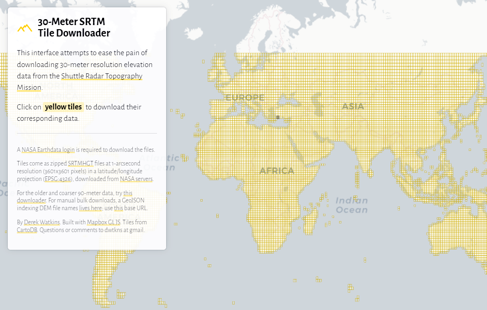

 
<!-- В строке ниже "../" - это переход к корню сайта. При этом текст "index.html" в пути можно и лучше опустить. После # - "подскок" к пункту "загрузка-цифровой-модели-рельефа" на главной странице. -->
◀️ [Вернуться на главную страницу](../#загрузка-цифровой-модели-рельефа)

 
Теперь, когда вы определились с районом работ и знаете идентификатор (номенклатуру) нужного тайла **цифровой модели рельефа** для создаваемой вами 3D&#8209;модели территории, 
необходимо загрузить себе на компьютер саму цифровую модель рельефа (ЦМР).

### Понятие ЦМР, существующие способы их создания и особенности представления

Цифровая модель рельефа, ЦМР (digital elevation model, DEM) — это средство трехмерного цифрового представления рельефа какой-либо местности. \
В простейшем варианте цифровые модели рельефа представляют собой совокупность значений высот земной поверхности, чаще всего в узлах регулярной сетки с образованием матрицы высот. \
Точность ЦМР определяется в первую очередь ее разрешением (горизонтальным расстоянием между узлами сетки или точками выборки). 
Основным способом цифрового представления рельефа в геоинформационных системах являются растровые форматы.

 
Источниками данных для создания цифровых моделей рельефа могут быть:
- цифровые топографические карты и планы территорий, содержащие информацию о высотных отметках, горизонталях, обрывах (например: дамбах, насыпях и выемках);
- стереопары космических снимков в оптическом диапазоне;
- стереопары аэрофотоснимков и снимков с беспилотных летательных аппаратов (БПЛА);
- данные радарной интерферометрии со спутников или пилотируемых аппаратов;
- данные воздушного лазерного сканирования.

> Глобальные цифровые модели рельефа, как правило, строятся по данным космической радарной и стереосъемки.

 
В настоящее время в открытом доступе имеется множество разнообразных и полностью готовых к&nbsp;использованию **глобальных** ЦМР с разрешением в 1&quot; угловую секунду в одном пикселе
(примерно 30&nbsp;метров в широтном направлении и в районе экватора). \
Как правило они представляют собой значения высот земной поверхности относительно эллипсоида **WGS&nbsp;84** в метрах.

Загрузить открытые глобальные цифровые модели рельефа можно со специальных порталов и через различные веб&#8209;каталоги пространственных данных. Это становится возможным после несложной предварительной регистрации пользователя.

Обычно продукт представляет собой набор файлов, каждый из которых покрывает территорию размером 1° на 1°. В названии каждого файла содержатся координаты левого нижнего угла покрытия.
Сами же данные предоставляются в географической системе координат **EPSG:4326** (широта/долгота на эллипсоиде WGS&nbsp;84).

### Где можно найти и каким образом загрузить необходимую для работы ЦМР

В данном случае, для выполнения работы, вам предлагается использовать глобальную цифровую модель рельефа **SRTM** (NASA Shuttle Radar Topography Mission) версии **SRTMGL1v003**. \
С подробным описанием цифровой модели рельефа SRTM, а также особенностями и преимуществами ее версии 003, можно ознакомиться перейдя по 
   <a href="https://lpdaac.usgs.gov/products/srtmgl1v003" 
      title="Ссылка на сайт с описанием SRTMGL1v003" 
      target="_blank">
      <b>ссылке</b></a>.

SRTM покрывает территорию, расположенную между **60°** северной широты и **56°** южной широты. \
Хотя это составляет около 80% всей суши Земли, важные северные территории планеты (включая обширные районы севера России) <u>данными SRTM не обеспечены</u>[^note].

Скачать файл необходимого тайла цифровой модели рельефа SRTM можно с помощью удобного сервиса **30&#8209;Meter SRTM Tile Downloader**, перейдя к нему по ссылке
   <a href="https://dwtkns.com/srtm30m"
      title="Ссылка на сайт «30&#8209;Meter SRTM Tile Downloader»"
      target="_blank">
      <b>https://dwtkns.com/srtm30m</b></a>.

 
От пользователя требуется найти на карте необходимый тайл суши, щелкнуть по нему левой клавишей мыши, проверить в появившемся всплывающем меню идентификатор (номенклатуру) выбранного тайла 
и нажать кнопку «**Download DEM**» для загрузки соответствующей ЦМР[^note].

 
После этого откроется форма авторизации, в которой требуется ввести «Имя&nbsp;пользователя» и «Пароль», необходимые для получения доступа на портал **NASA&nbsp;Earthdata**.

 
Пройдите несложную регистрацию на портале **NASA Earthdata**, перейдя по ссылке
   <a href="https://urs.earthdata.nasa.gov/users/new"
      title="Ссылка на страницу регистрации на портале NASA Earthdata"
      target="_blank">
      <b>https://dwtkns.com/srtm30m</b></a>, 
и получите необходимые учетные данные.

>#### Обязательно сохраните данные о вашей регистрации (Login и Password) в отдельный текстовый файл для последующего использования вами портала **NASA&nbsp;Earthdata**.

Завершите загрузку цифровой модели рельефа необходимого вам тайла, введя в форму авторизации на рисунке выше данные вашей регистрации (Логин и Пароль) и нажав кнопку «**Вход**». \
**ZIP&#8209;архив** с ЦМР *(в моем примере это файл с именем «N37E027.SRTMGL1.hgt.zip»)* незамедлительно скачается в папку «**Загрузки**» (Downloads) на вашем компьютере.

В загруженном ZIP&#8209;архиве содержится один файл с расширением **\*.hgt** *(в моем примере он будет иметь имя «N37E027.hgt»)*.
Переместите ZIP&#8209;архив из папки «Загрузки» (Downloads) в вашу рабочую папку и извлеките из него в рабочую же папку hgt&#8209;файл с цифровой моделью рельефа. \
Размер распакованного hgt&#8209;файла составляет приблизительно 25 Мбайт.
  
>#### ***Важная рекомендация:***
> <i>При добавлении цифровой модели рельефа в ваш QGIS&#8209;проект перетягивайте на окно программы **именно распакованный** (извлеченный из ZIP&#8209;архива) **hgt&#8209;файл** ЦМР, 
> а&nbsp;не&nbsp;изначально скаченный файл ZIP&#8209;архива.  
> При попытке открыть перетягиванием на окно QGIS изначально скаченного ZIP&#8209;файла, программа может выдать **сообщение об&nbsp;ошибке**.</i>

[^note]: В случае отсутствия покрытия необходимого вам района данными ЦМР SRTM, **обязательно** обратитесь к преподавателю. Для обеспечения покрытие будут привлечены альтернативные варианты ЦМР (ASTER&nbsp;GDEM, ALOS&nbsp;World&nbsp;3D, FABDEM), гарантированно покрывающие нужную вам территорию.

 
  
 <!-- разделительная линия ======================================================== -->

 
🔼 [Наверх](./how_to_download_dem.html)
  
