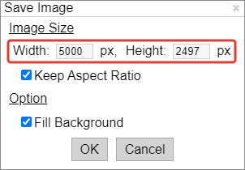

 
<!-- В строке ниже "../" - это переход к корню сайта. При этом текст "index.html" в пути можно и лучше опустить. После # - "подскок" к пункту "выбор-варианта-работы" на главной странице. -->
<!-- Для данной страницы (Как работать с 3D-моделью в браузере) я ее закомментил, так как с основной станицы переход сюда из двух мест. -->
<!-- ◀️ [Вернуться на главную страницу](../#создание-анимации-пролета-над-поверхностью-3d-модели) -->
<!-- Но раскомментил target="_blank" чтобы Инструкция открывалось в новой странице. ">", которую до этого пришлось перенести в строку выше, вернул на место -->

## Инструкция: «Как работать с 3D&#8209;моделью в браузере»

Для лучшего обзора 3D&#8209;модели перейдите в полноэкранный режим просмотра веб&#8209;страницы. \
Для этого, находясь в используемом вами интернет&#8209;браузере (Google&nbsp;Chrome, Microsoft&nbsp;Edge, Internet&nbsp;Explorer) нажмите на клавиатуре клавишу «**F11**». \
*Для выхода из полноэкранного режима повторно нажмите клавишу «F11».*

При нажатии на клавиатуре на клавишу «**R**», 3D&#8209;модель начнет плавно вращаться. \
*Для остановки вращения нажмите клавишу «R» повторно.*

При нажатии на клавиатуре клавиши «**H**» исчезнет панель меню, полностью освободив экран просмотра 3D&#8209;модели. \
*Восстановить панель меню можно нажав клавишу «H» повторно.*

Вращать/наклонять/приближать/двигать 3D&#8209;модель можно с помощью мышки *(колесиком, левой и правой кнопками мыши)*. 
Но очень удобно (даже лучше, чем мышкой) управлять 3D&#8209;моделью с&nbsp;помощью клавиатуры. 
При этом очень важны и эффективны комбинации с клавишами «**Shift**» и «**Ctrl**» на клавиатуре.

Какая клавиша и комбинации клавиш за какую функцию отвечают, можно посмотреть, нажав на клавиатуре клавишу «**I**» – откроется панель краткой справки с соответствующим описанием:

 \
*Закрыть панель можно нажав на клавиатуре клавишу «Esc».*

Непосредственно на самой 3D&#8209;модели можно получать (измерять) координаты интересующих вас точек *(в том числе и их высоту над уровнем моря)*, 
просто щелкнув по интересующему месту левой кнопкой мыши. Измеряемая точка отобразится на 3D&#8209;модели в виде желтого шарика. \
К этой точке можно приблизиться, нажав в панели с координатами кнопку с изображением лупы. \
А если нажать на кнопку «**Orbit**», то запустится вращение 3D&#8209;модели вокруг данной точки. \
*Для остановки вращения нажмите на клавиатуре клавишу «R».*

Имеется удобная и важная возможность сохранять непосредственно из браузера выбранные вами красивые ракурсы 3D&#8209;модели как PNG&#8209;изображения в задаваемом вами хорошем (высоком) разрешении. 
Для этого нажмите на клавиатуре комбинацию клавиш «**Shift&nbsp;+&nbsp;S**».

 
Открывать (запускать) html&#8209;файл вашей веб&#8209;страницы с 3D&#8209;моделью можно и на локальной машине (компьютере). При этом доступ в интернет не требуется.
> *Возможность просмотра html&#8209;веб&#8209;страницы на локальной машине поддерживается только в том случае, 
>  если при экспорте 3D&#8209;модели была включена опция «Enable&nbsp;the&nbsp;viewer&nbsp;to&nbsp;run&nbsp;locally».*

 
Приведенные выше рекомендации безусловно будут вам полезны как при работе с 3D&#8209;моделью на уже опубликованном вами сайте (3D&#8209;геопортале), 
так и на этапе создания 3D&#8209;модели и подготовки (настройки) ее анимации.

 
  
 <!-- разделительная линия ======================================================== -->

 
🔼 [Наверх](./instruction_how_work_with_model_in_browser.html)
