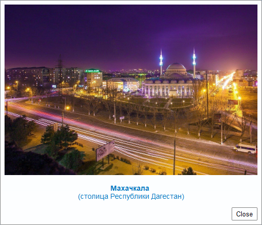

<br>
<!-- В строке ниже "../" - это переход к корню сайта. При этом текст "index.html" в пути можно и лучше опустить. После # - "подскок" к пункту "выбор-варианта-работы" на главной странице. -->
◀️ [Вернуться на главную страницу](../#наполнение-стоп-кадра-повествовательным-содержанием)


Аналогично тому, с чем вы уже познакомились и поэкспериментировали ранее при оформлении колонтитулов, красивое оформление стоп&#8209;кадров для анимации 
также создается с помощью HTML&#8209;синтаксиса (форматирования).
Любая информация (текс, html&#8209;теги, веб&#8209;ссылки), введенная вами в блоке «Narrative&nbsp;content» для стоп&#8209;кадра, 
при предстоящем экспорте 3D&#8209;модели с помощью модуля Qgis2threejs в итоговую в html&#8209;веб&#8209;страницу, интегрируется в ее индексный файл **`index.html`**.

Создать красивое оформление «Повествовательного содержания» стоп&#8209;кадра вашей анимации, сфокусированного на наиболее важном для территории вашей 3D&#8209;модели географическом объекте, 
вы легко сможете используя представленные ниже шаблоны (html&#8209;заготовки), адаптировав (отредактировав) их для вашего конкретного случая и в соответствии с вашими вкусовыми предпочтениями 
и представлениями о прекрасном.

<br>
  <hr> <!-- разделительная линия ======================================================== -->

### Шаблон № 1 (самый простой)

> Используйте его в качестве несложного и весьма наглядного примера html&#8209;кода для первичного ознакомления с базовым html&#8209;синтаксисом.

Применяйте шаблон №&nbsp;1 **только для оформления дополнительных стоп&#8209;кадров**, если решите создать их *(что, конечно, приветствуется)* – то есть только тогда, когда вы уже создали оформление для 
как минимум одного стоп&#8209;кадра в соответствии с более сложными шаблонами №&nbsp;2 и/или №&nbsp;3, включающими html&#8209;ссылки на внешние ресурсы.

*Оформление стоп&#8209;кадра:*

 \
 \
*html-код оформления стоп&#8209;кадра:*
```html

 <!-- Вставка фотографии по ее веб-ссылке (пути к ней) в интернет -->
 

 <!-- Вставка поясняющей подписи к фотографии с ее форматированием соответствующими html-тегами -->
 <p style="font-size: 14px; font-family: Arial; color: #0079c1; text-align: center">
 <b> Махачкала </b> <br>
 (столица Республики Дагестан)
 </p>

```
* *Свойство* **`width="500px"`** *определяет, что ширина элемента (в данном случае изображения) будет составлять 500&nbsp;пикселей.*

* *Свойство для стиля подписи* **`font-size: 14px`** *определяет, что размер шрифта в абзаце будет равен 14 пикселям.*

* *В данном примере свойство для стиля подписи* **`color: #0079c1`** *задает цвет ее шрифта в шестисимвольном HEX (шестнадцатеричном) коде.*

* *Тег* **`<b>`** *устанавливает жирное начертание шрифта (синтаксис* **`<b>жирный текст</b>`***). \
  Аналогично* тег **`<i>`** *устанавливает наклонное начертание шрифта (***`<i>наклонный текст</i>`***). \
  Определяющие начертание текста теги допустимо использовать совместно.*

* *Очень полезен тег* **`<br>`** *– устанавливает перевод строки (возврат каретки) в том месте, где он находится. 
  То есть все написанное после него, будет перенесено на новую строку.*

<br>
  <hr> <!-- разделительная линия ======================================================== -->

### Шаблон № 2 (средней сложности, с веб-ссылкой)

*Оформление стоп&#8209;кадра с веб&#8209;ссылкой:*

 \
 \
*html-код оформления стоп&#8209;кадра с веб&#8209;ссылкой:*
```html

 <!-- Вставка фотографии, хранящейся на вашем компьютере локально -->
 <!-- (в этом примере фотография находится на диске "C:" в папке "12345") -->
 <!-- ВАЖНО: путь в этом "локальном" случае должен начинаться с "file:///" -->
 

 <!-- Вставка подписи к фотографии с ее html-форматированием -->
 <p style="font-size: 14px; font-family: Arial; color: #0079c1; text-align: center;">
    <b> Центральная Джума-мечеть (Махачкала, Дагестан) </b>
 </p>

 <!-- Создаем стиль ссылки, изменяющей свой цвет, на страницу в Википедии -->
 <style>
    a {color: green;}  /* задает основной цвет текста самой ссылки */
    a:hover { color: red; }  /* задает цвет текста ссылки при наведении на нее указателя мыши */
 </style>

 <p style="font-size: 14px; font-family: Arial; color: #0079c1; text-align: center">
 (открыть страницу в Википедии можно по 
    <a href="https://ru.wikipedia.org/wiki/Центральная_Джума-мечеть_(Махачкала)"
       title="ссылка на страницу в Википедии" 
       target="_blank">
       <b>ссылке</b></a>)
 </p>

```
* *Атрибут* **`target="_blank"`** *открывает страницу Википедии в новом окне браузера.*

<br>
  <hr> <!-- разделительная линия ======================================================== -->

### Шаблон № 3 (более сложный, с веб-ссылкой)

*Более сложное оформление стоп&#8209;кадра с веб&#8209;ссылкой:*

 \
 \
*html-код более сложного оформления стоп&#8209;кадра с веб&#8209;ссылкой:*
```html

 <!-- Вставка фотографии, хранящейся на вашем компьютере локально -->
 <!-- (в этом примере фотография находится на диске "C:" в папке "12345") -->
 <!-- ВАЖНО: путь в этом "локальном" случае должен начинаться с "file:///" -->
 

 <!-- Вставка подписи к фотографии с ее html-форматированием -->
 <p style="font-size: 14px; font-family: Arial; color: #0079c1; text-align: center;">
    <b>Парк имени Гейдара Алиева, Гянджа</b>
 <br>
    <i>(самый крупный парк на Кавказе с территорией 450 га)</i>
 </p>
 <br>

 <!-- Создаем стиль ссылки, изменяющей свой цвет, на страницу в Википедии -->
 <style>
    a {color: green;}  /* задает основной цвет текста самой ссылки */
    a:hover { color: red; }  /* задает цвет текста ссылки при наведении на нее указателя мыши */
 </style>

 <p style="font-size: 14px; font-family: Arial; color: #0079c1; text-align: center">
 (открыть страницу в Википедии, посвященную городу Гянджа, можно по 
    <a href="https://ru.wikipedia.org/wiki/Гянджа" 
       title="ссылка на страницу в Википедии" 
       target="_blank">
       <b>ссылке</b></a>)
 <br><br>

 <!-- Вставка двух последних строк текста в шаблоне с их форматированием html-тегами -->
 <i><b>Гянджа</b> - город республиканского подчинения Азербайджана,<br>
 третий по численности населения и второй по площади в стране.</i>
 </p>

```

<br>
  <hr> <!-- разделительная линия ======================================================== -->

<br>
🔼 [Наверх](./templates_for_narrative_content.html)
